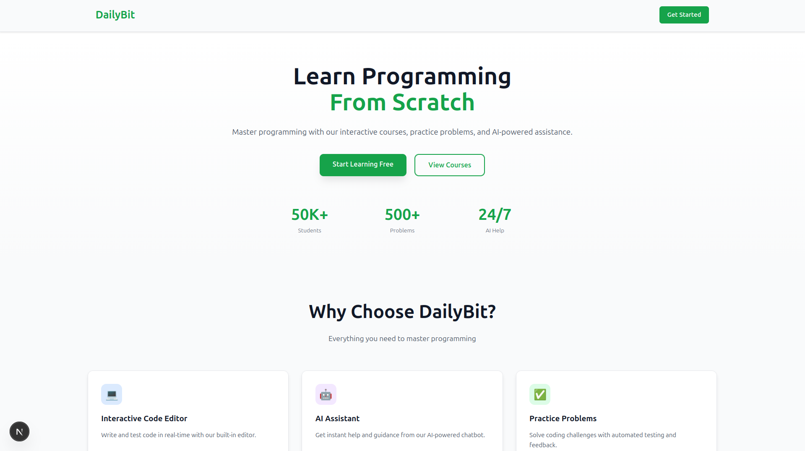
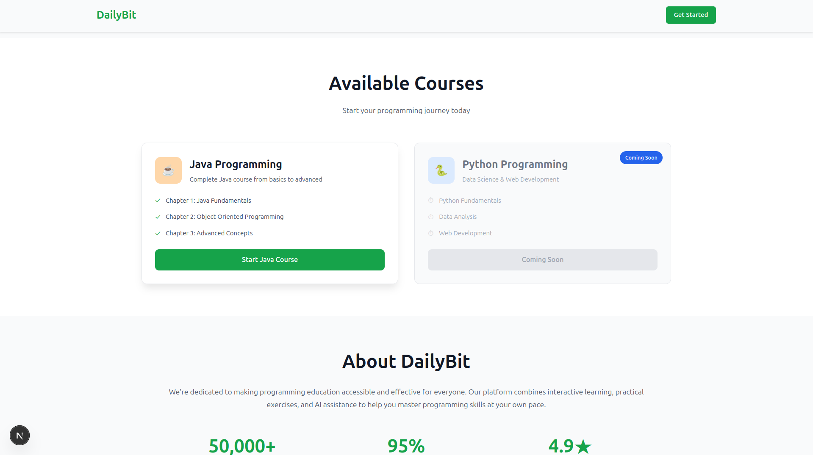
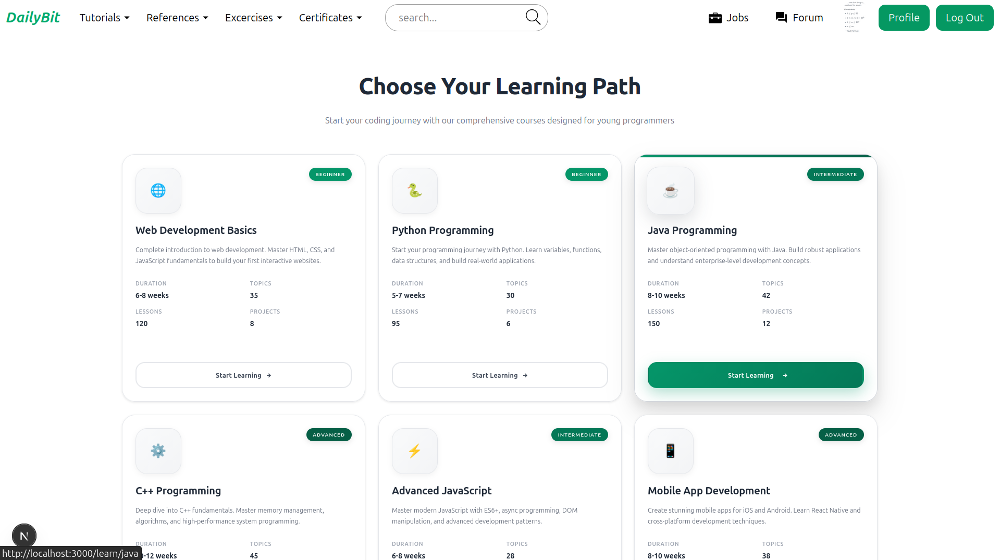
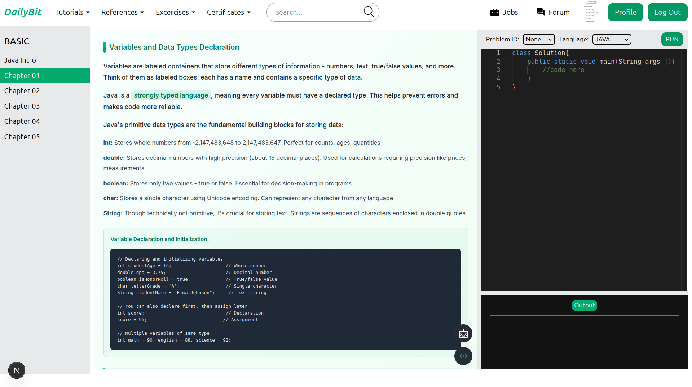
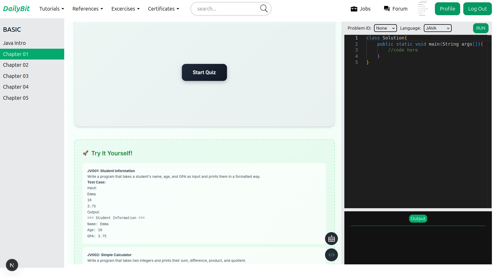

# DailyBit

<p align="center">
  
  
  
  
  
</p>

DailyBit is a learning platform with an AI-guided help system, in-browser coding, and chapter-based quizzes.

## Features

- AI chat bot help system using RAG for contextual assistance
- In-platform code editor with Docker-based judge execution
- Authentication and user profiles
- Admin panel for problems, test cases, and content
- AI-powered quiz system for each chapter

## Tech Stack

**Frontend**
- Next.js 15 (App Router), React 19, TypeScript
- TanStack Query, Redux Toolkit
- Monaco editor, Sass, Tailwind CSS

**Backend**
- Spring Boot 3.5.5, Java 18
- PostgreSQL, Spring Security, JWT
- Docker-based Java judge runner

**AI Service**
- Separate RAG service expected at `http://localhost:8000`

## Project Structure

- `dailybit_frontend/` - Next.js frontend
- `DailyBit-Backend/` - Spring Boot backend

## Getting Started

### Prerequisites

- Node.js 18+ (recommended 20+)
- pnpm (or npm/yarn/bun)
- Java 18
- Docker (required for code judging)
- PostgreSQL database

### Frontend

```bash
cd dailybit_frontend
pnpm install
pnpm dev
```

### Backend

```bash
cd DailyBit-Backend
./mvnw spring-boot:run
```

### AI Service (RAG)

Run your AI service separately on `http://localhost:8000` to support the chat bot.

## Configuration Notes

- Backend API base URL: [dailybit_frontend/src/helper/backendDomain.ts](dailybit_frontend/src/helper/backendDomain.ts#L1)
- AI service base URL: [dailybit_frontend/src/helper/backendAIDomain.ts](dailybit_frontend/src/helper/backendAIDomain.ts#L1)
- Database connection is configured in [DailyBit-Backend/src/main/resources/application.yaml](DailyBit-Backend/src/main/resources/application.yaml#L1-L9)
- Docker-based judge uses `openjdk:26-slim` and runs code in a containerized sandbox: [DailyBit-Backend/src/main/java/com/DailyBit/judge/services/JavaJudgeService.java](DailyBit-Backend/src/main/java/com/DailyBit/judge/services/JavaJudgeService.java#L31-L66)

## Usage

- Open the app at `http://localhost:3000`
- Log in or create an account to access learning content
- Use the editor to solve problems and run submissions
- Admin features are available from the admin routes in the app
